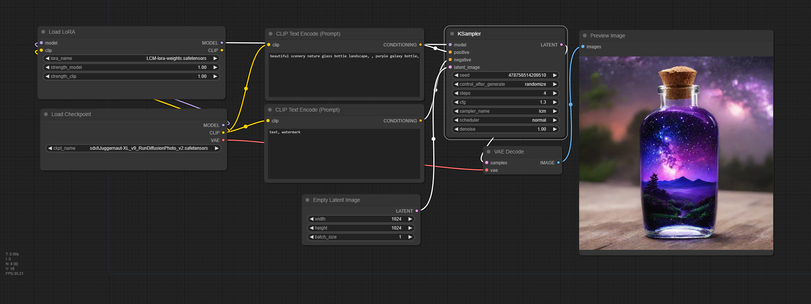
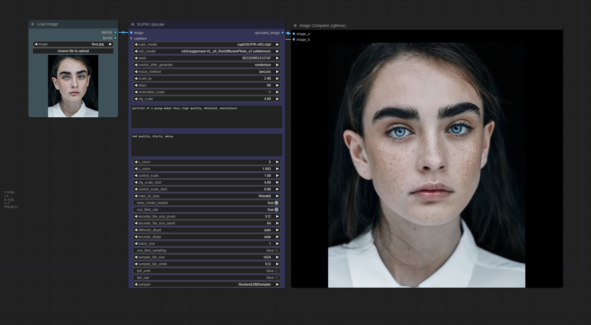
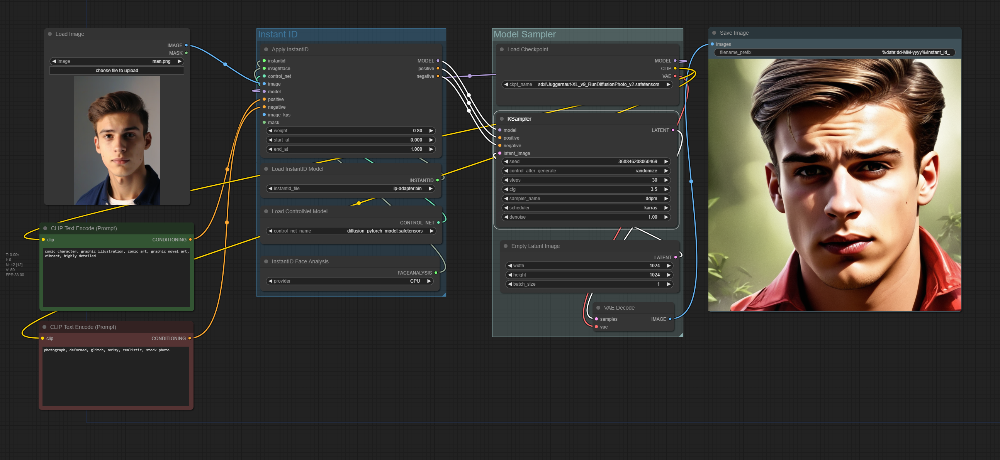
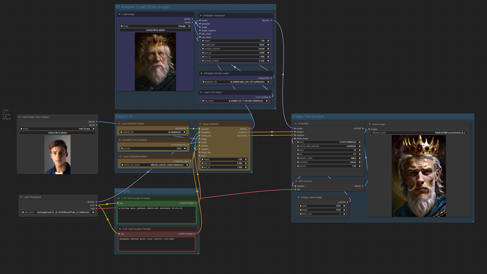

# Workflows

Basic workflows to get started with comfy and the installed models by this repo.

Just drag the picture into comfy and it will load the workflow.

# Table of contents
1. [LCM SDXL Lora](#lcm-sdxl-lora)
2. [SUPIR Upscaler](#supir-upscale)
3. [Face InstantID](#instant-id-with-ip-adapter)
4. [Face InstantID + IP Adapter](#instant-id-with-ip-adapter)

## LCM SDXL Lora

Example for [LCM SDXL](https://huggingface.co/latent-consistency/lcm-lora-sdxl), Latent Consistency Model (LCM) is a good method to generate images with very low steps what results in very fast generation.

Useful for testing prompts and setting fast.

## SUPIR Upscaler

[SUPIR by xpixel](https://supir.xpixel.group/) Upscaler.

## Instant ID 

Preserve character face with combination of prompt.

## Instant ID with IP Adapter

Preserve character face with combination of prompt and style using instant ID and IP Adapter.

